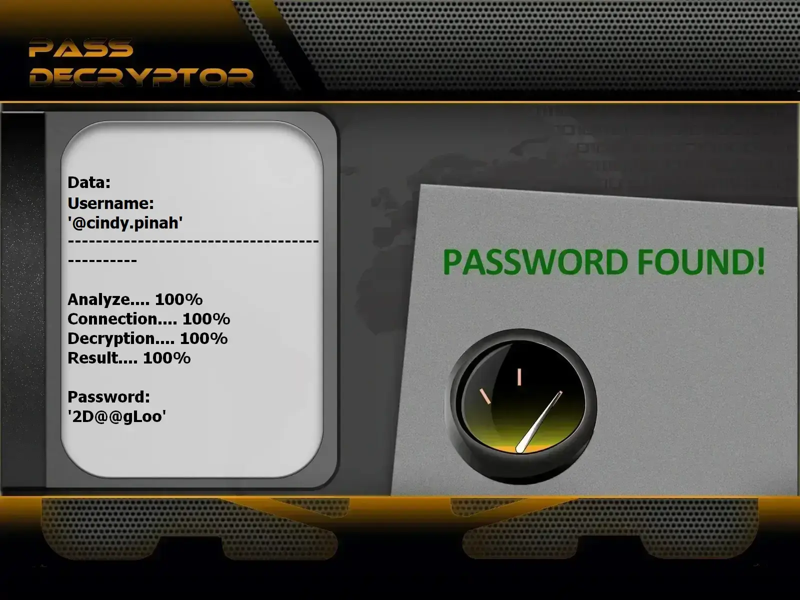

# 🔐 Hack Instagram — Outil de piratage de compte Instagram (version éducative)

**Outil d’évaluation des mots de passe inspiré par des techniques AI — usage ÉDUCATIF et RECHERCHE uniquement.**

  

---

## ⚠️ AVERTISSEMENT LÉGAL IMPORTANT

**Ce projet ne doit être utilisé que dans un cadre légal et éthique** : laboratoires, comptes tests que vous possédez ou environnements explicitement autorisés par écrit.
Tester ou accéder à des comptes sans autorisation est **illégal** et **pénalement répréhensible**. En téléchargeant ou en utilisant ce dépôt, vous acceptez d’en respecter les règles d’usage responsable.

**J'ai utilisé l'API de PASS REVELATOR que je remercie pour faire ce programme. Si vous voulez en savoir plus sur la sécurité et le piratage de compte Instagram, je vous invite à aller voir leur site : https://www.passwordrevelator.net/fr/passdecryptor**




---

## 🧭 Présentation

`Hack Instagram` est présenté ici comme une **simulation pédagogique** destinée à démontrer comment les méthodes d’analyse (y compris des techniques d’IA/ML) peuvent aider à comprendre les vulnérabilités de mots de passe et à améliorer les défenses. Les modules fournis sont orientés vers la recherche, la formation et la sensibilisation.

---

## 🎯 Objectifs pédagogiques

* Sensibiliser aux risques liés aux mots de passe faibles.
* Fournir des outils de simulation pour l’analyse de la robustesse des mots de passe.
* Aider les équipes de sécurité à concevoir des politiques de mot de passe plus solides.
* Servir de base pour la recherche sur les contre-mesures basées sur l’IA.

---

## 🛠️ Installation (pour simulation / recherche)

```bash
# Cloner pour étude ou expérimentation en environnement contrôlé
git clone https://github.com/HoffmannAlex/Hack-Instagram-Account-with-AI/hack-instagram-sim.git
cd hack-instagram-sim
pip install -r requirements.txt
```

> Tous les exemples fournis sont destinés à un usage éducatif

---

## 🔐 Bonnes pratiques & éthique

* N’exécutez aucune expérience contre des comptes ou systèmes sans **autorisation explicite écrite**.
* Documentez toute expérimentation et conservez des preuves d’autorisation.
* Privilégiez les environnements isolés (machines virtuelles, comptes tests).
* Respectez la législation locale et les politiques de votre organisation.

---

## 🤝 Contribution

Les contributions centrées sur la **sécurité défensive, l’éducation**, et la **recherche éthique** sont les bienvenues. Merci de lire `CONTRIBUTING.md` et de signer le CLA si nécessaire. Tout contributeur doit confirmer qu’il utilisera le code selon les règles éthiques du dépôt.

---

## 📜 Licence

Projet publié pour **usage éducatif uniquement**. Incluez un fichier `LICENSE` et un texte clair dans le README indiquant que toute utilisation non autorisée est interdite.
